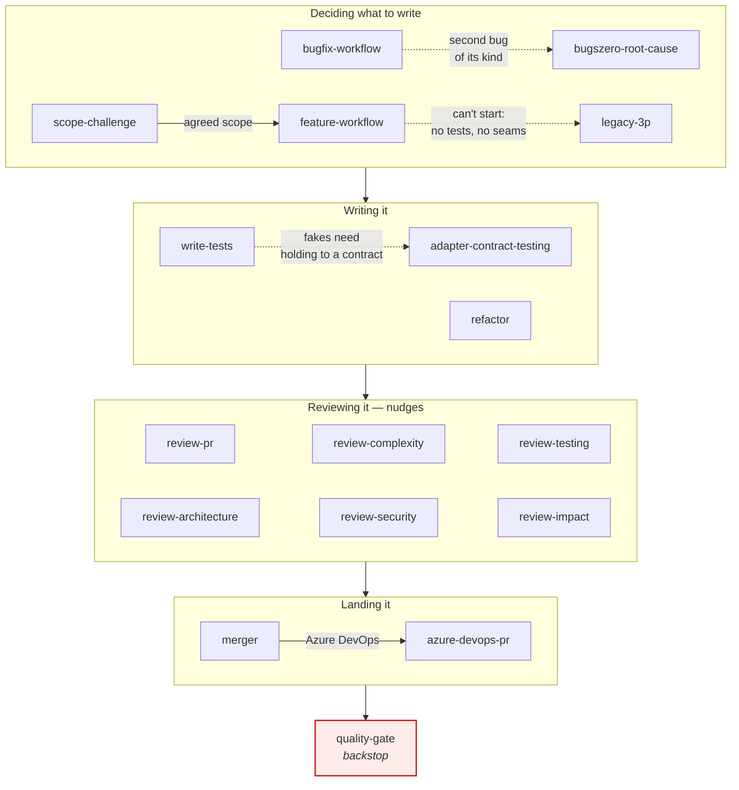
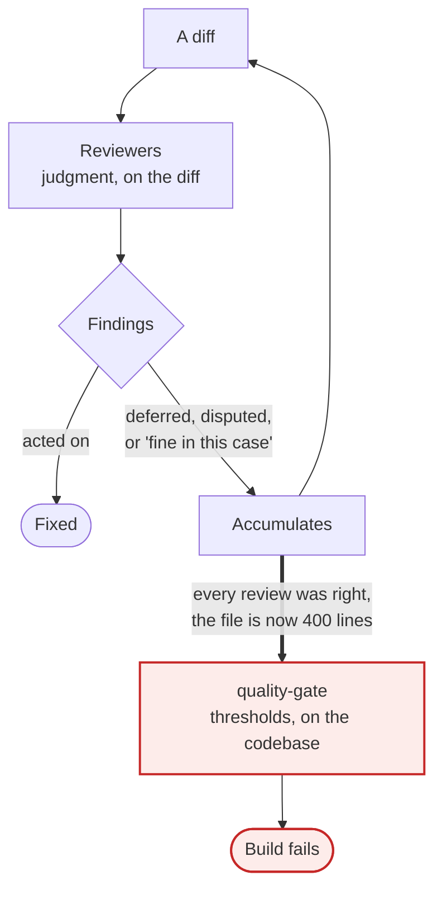
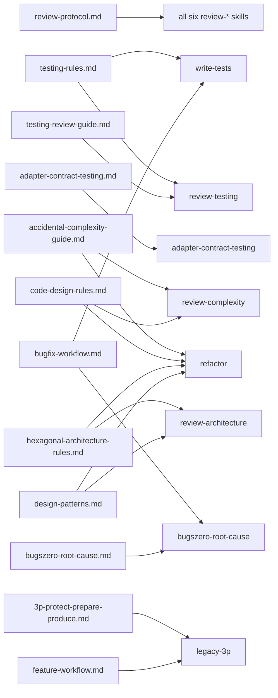

# Library Map

How the pieces relate. Prose version in [`AGENTS.md`](../AGENTS.md); this is the shape.

## Where each thing acts

Everything in the library sits somewhere on the path from *deciding to change code* to
*that change being live* — and the further right it sits, the less it argues.

`review-impact` is the exception to the left-to-right reading: run it **before** pushing,
not during review. It answers "what did I just put at risk", and its output is a list of
test suites to run.

## Nudges and the backstop

The reviewers report and hope. That works most of the time, and the failures are silent —
which is the whole reason the last box exists.

The loop on the left is the normal case and it is not a failure — most "fine in this case"
judgements really are fine. But nothing in that loop can see the fourteenth reasonable
increment, because each review only ever sees one. The gate reads the file rather than the
diff, so it sees the total; that is the only thing it is better at, and it is enough.

A gate that fires is therefore evidence about the loop as much as about the file. If the
same file trips it every release, the reviewers have been raising it and nobody has been
acting.

## The docs behind the skills

Knowledge lives in `docs/` when more than one thing needs it. Extraction is what stops the
copies drifting — the review protocol was worded three different ways before it was pulled
out.

The two rules pages and the complexity guide are the same knowledge from two directions:
the rules say what the code should look like, the guide says what to search for and how bad
it is when you find it. Keeping them apart is what stops the guide turning into a style
manifesto and the rules into a second, drifting catalogue.

One consequence worth stating: **`legacy-3p`'s Protect tests deliberately violate
`testing-rules.md`.** They are quick-and-dirty scaffolding, most of them deleted in Prepare.
Reviewing them against the testing rules is a category error, so `review-testing` needs to
be told which phase it is looking at.
