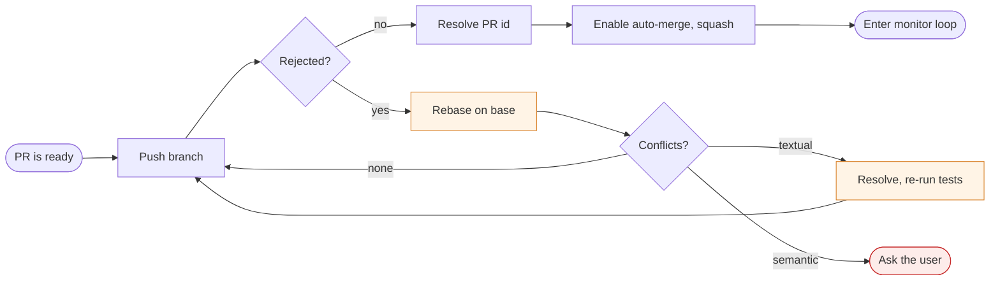
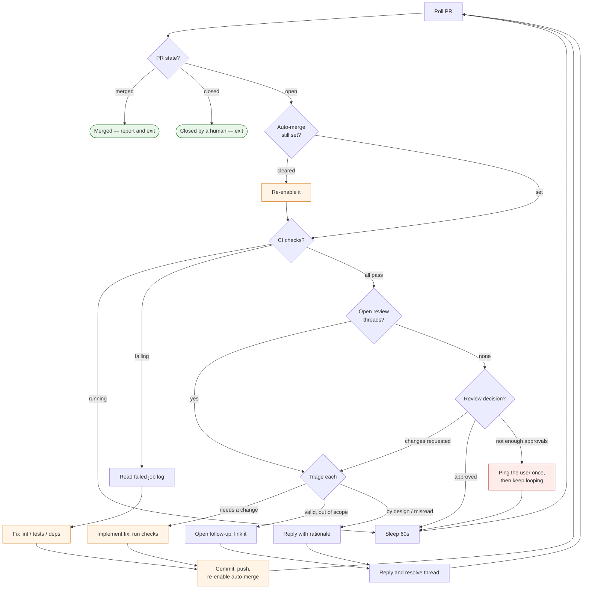

# Merger Agent — Lifecycle

What [`agents/merger`](../agents/merger.md) does between "this PR is ready" and "this PR is
merged".

## Setup

Runs once. The only interesting part is that a rejected push means the base branch moved,
which is a rebase, which can end in a conflict the agent should not guess at.

## The monitor loop

Every 60 seconds, until the PR merges or closes. Each iteration reports one line of state
first, so a watching human can see what it thinks is happening.

Read it top to bottom: each gate must be clear before the next one is even looked at. A
failing check means review comments are not read this iteration — there is no point
addressing feedback on code that is about to change.

**Every fix returns to the top.** A push can clear auto-merge and invalidates checks that
had already passed, so nothing continues forward after a change; it re-enters at `Poll`.

## What it never does

- **Merge by hand.** It sets auto-merge and makes the conditions true; the platform merges.
- **Exit while CI is running.** A pending check means sleep and re-poll, not "probably fine".
- **Approve the PR.** Missing human approval is the one blocker it cannot clear — so it
  pings *once* and keeps looping rather than exiting, and the PR lands the moment someone
  approves.
- **Silently resolve a thread it disagreed with.** By-design gets a written rationale;
  out-of-scope gets a rationale *and* a tracked follow-up.
- **Force-push past a conflict it did not understand.** Textual conflicts it resolves;
  semantic ones it escalates.
